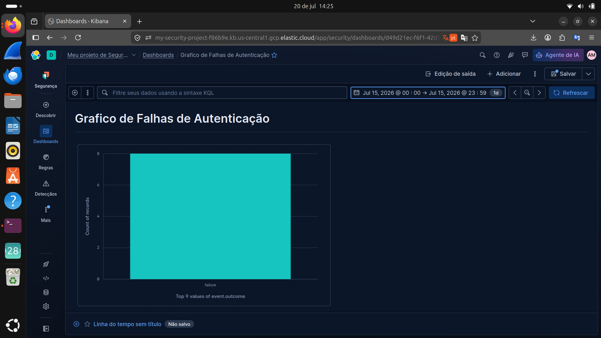
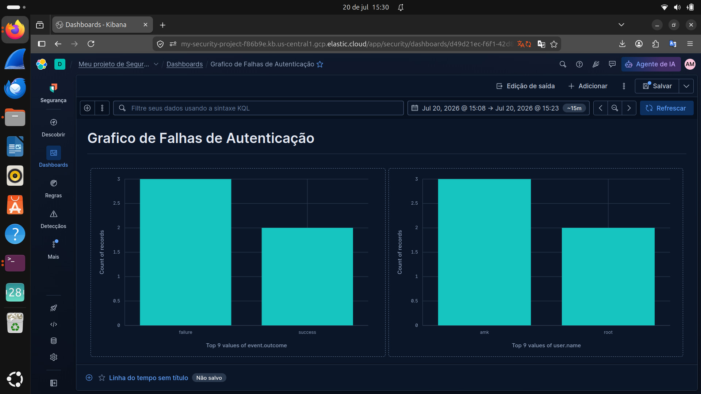
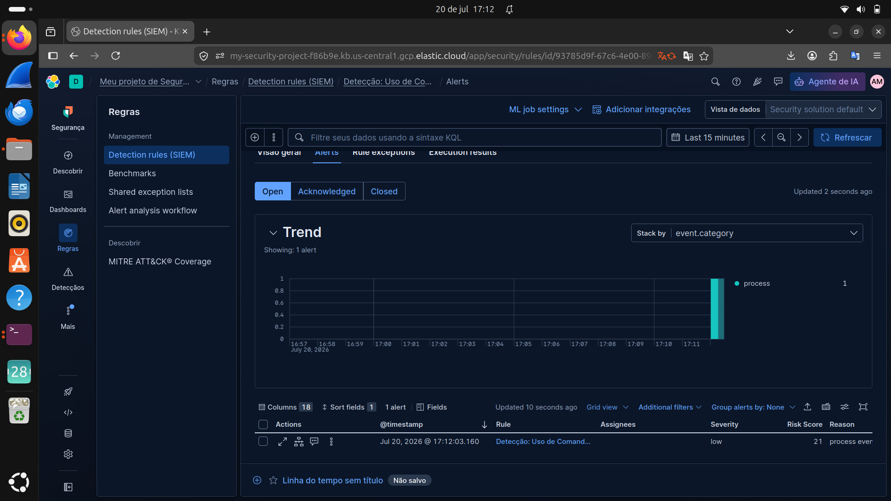

## 🛡️ Monitoramento e Detecção de Incidentes

Nesta etapa, configurei um filtro de monitoramento para identificar tentativas de acesso não autorizadas no sistema. 

### Filtro de Detecção
Utilizei a seguinte query de consulta para isolar eventos de falha de autenticação:
`event.dataset : "system.auth" AND event.outcome : "failure"`

### Evidência de Monitoramento
Abaixo, o print do Kibana demonstrando a captura desses eventos em tempo real:

*Nota de Segurança: Os dados sensíveis de identificação do agente e do sistema foram anonimizados para garantir as boas práticas de proteção de dados.*

### 📊 Dashboard de Falhas de Autenticação
Visualização gráfica das tentativas de acesso, permitindo identificar padrões de falhas (`event.outcome: failure`).

### Monitoramento de Segurança: Falhas de Autenticação

Este gráfico demonstra a validação bem-sucedida do nosso sistema de detecção de ameaças no Elastic. 
* **O que foi feito:** Configuramos uma regra de detecção no SIEM para identificar tentativas de login falhas (`event.outcome: failure`) nos logs do sistema (`system.auth`).
* **Validação:** Realizamos um teste de intrusão local via terminal, simulando logins incorretos para os usuários 'root' e 'amk'.
* **Resultado:** O sistema detectou o comportamento, gerou alertas em tempo real e os consolidou neste painel, permitindo a identificação imediata dos alvos (usuários) e da frequência das tentativas.

## Monitoramento de Processos Críticos
* **Objetivo:** Identificar o uso de comandos que elevam privilégios, como o `sudo`.
* **Filtro KQL:** `event.category : "process" AND process.name : "sudo"`
* **Explicação técnica:**
    * `event.category : "process"`: Filtra apenas eventos classificados como execução de programas pelo ECS (Elastic Common Schema).
    * `process.name : "sudo"`: Especifica o monitoramento apenas para o comando sudo.
* **Por que isso é importante:** Monitorar o `sudo` é essencial para detectar tentativas de manipulação do sistema por usuários não autorizados.

