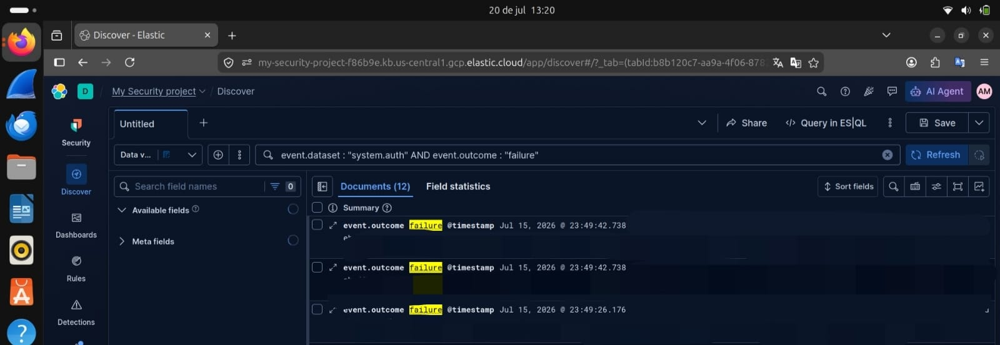

## 🛡️ Monitoramento e Detecção de Incidentes

Nesta etapa, configurei um filtro de monitoramento para identificar tentativas de acesso não autorizadas no sistema. 

### Filtro de Detecção
Utilizei a seguinte query de consulta para isolar eventos de falha de autenticação:
`event.dataset : "system.auth" AND event.outcome : "failure"`

### Evidência de Monitoramento
Abaixo, o print do Kibana demonstrando a captura desses eventos em tempo real:

*Nota de Segurança: Os dados sensíveis de identificação do agente e do sistema foram anonimizados para garantir as boas práticas de proteção de dados.*
